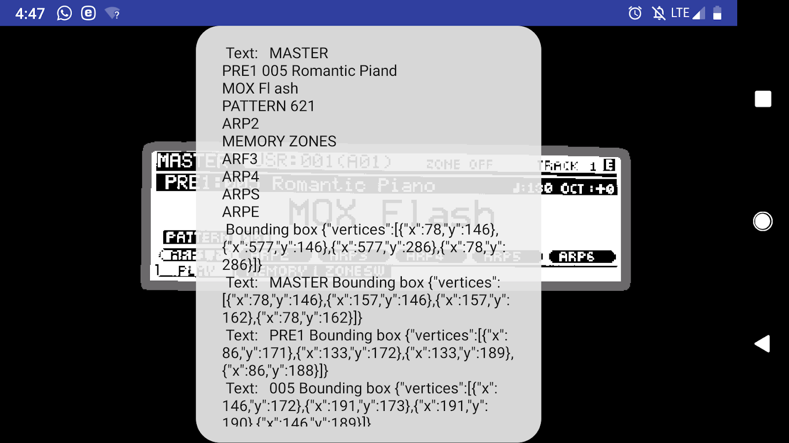

# MidiScreenReader
MidiScreenReader is a mobile OCR application that provides accessible audio feedback to allow a visually impared musician to control and use a Yamaha MOXF6 MIDI keyboard controller

The application uses the Google Cloud Vision API in addition to image preprocessing teqniques to perform OCR on the screen of the Yamaha MOXF6 MIDI keyboard, and provides audio prompts and instructions to the user.

# Screenshot

Application screenshot with processed image and detected text
